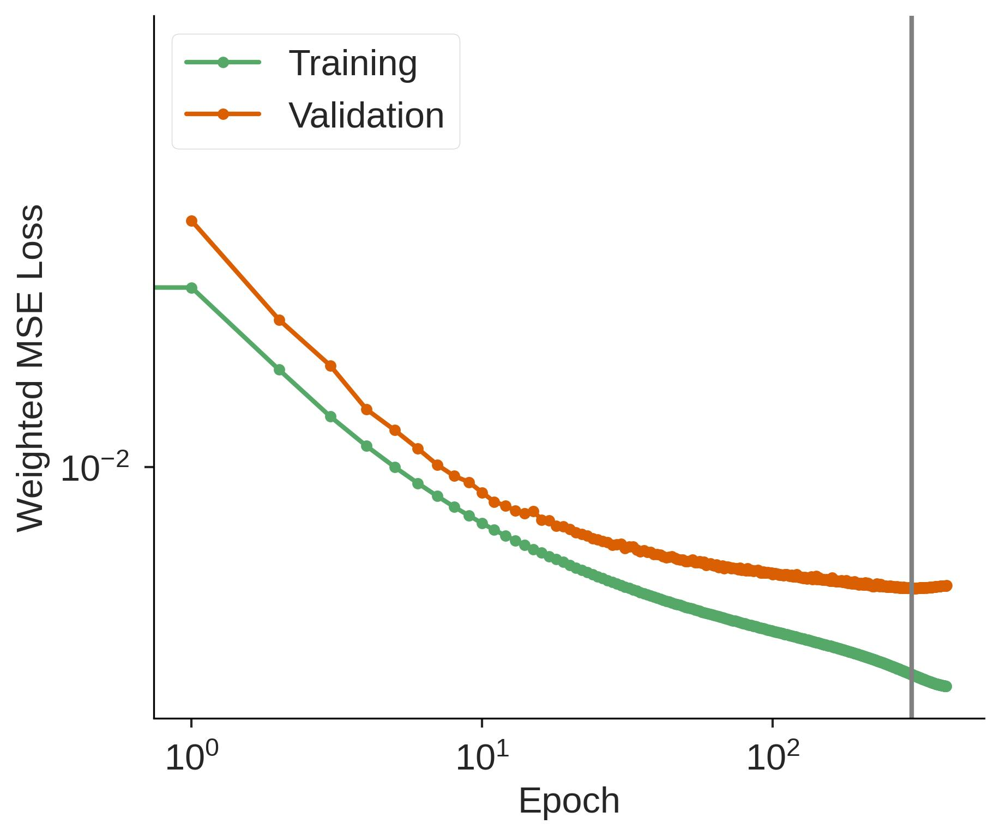

# Latitude-Longitude Latent Mesh

## Training and Inference

```
pip install anemoi-datasets==0.5.26 anemoi-graphs==0.6.4 anemoi-models==0.9.2 anemoi-training==0.6.2 anemoi-inference==0.7.1 anemoi-utils==0.4.35 anemoi-transform==0.1.16
```

## Max steps vs epochs

Note that I initially was training to 300k iterations, but this cycles through
the dataset more than we need.
Looking at the validation loss, it starts to tail off at 300 epochs, and even
starts to increase a bit afterward.
So, 300 epochs seems like a reasonable stopping point


